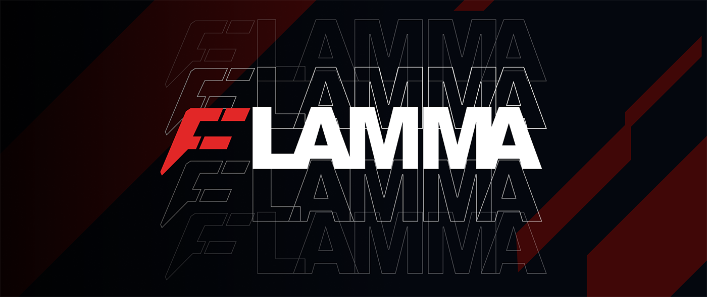

# Overview
 
Flamma is a sequence-based blockchain designed for large-scale commercial applications. It features a high-performance network suitable for various use cases, including finance, payments, and gaming. The Flamma Network is open, interoperable, and decentralized, allowing anyone to quickly build super applications on its platform.

## Get Started - Launch a Solidity Dapp on Flamma

| Kickoff   |  |
| :----- | :---- |
| [Get $FLA Test Funds](https://flafaucet.dev/)     |  Get test tokens to use on the Flamma network for development and testing purposes.   |
| [Deploy with Remix IDE]() | Utilize the Remix Integrated Development Environment to write, compile, and deploy smart contracts effortlessly.  |
| [Create an ERC-20 Token (🛩️No Code)](/pages/QuickDappDeploy/erc20.mdx) | how to implement a no-code deployment of an ERC20 token using Remix and OpenZeppelin.  |
| [Deploy an NFT Collection (🛩️No Code)]() | Launch a collection of [ERC-721](https://eips.ethereum.org/EIPS/eip-721) Non-Fungible Tokens (NFTs) to represent unique digital assets.  |
| [Integrate a Wallet in Your Front-End Application]() | Integrating a cryptocurrency wallet into your front-end application allows users to interact directly with the Flamma network from your website.  |
| [ERC20 Token Claim Front-End Template]() | This front-end template allows users to claim their ERC20 tokens seamlessly. Built with modern web technologies, the template provides an intuitive and secure interface for interacting with smart contracts.  |

## Development Tools and EVM Compatibility

The Flamma Network fully supports all standard Ethereum Virtual Machine (EVM) development tools, making it easy for developers to build and deploy decentralized applications (DApps) on the network. This compatibility ensures that developers can leverage their existing knowledge and tools from the Ethereum ecosystem when working with Flamma.

| DevTools  |  |
| :----- | :---- |
| [Metamask](https://metamask.io/)     |  A browser extension wallet that allows users to interact with DApps directly from their browsers. It supports the Flamma Network for seamless integration.   |
| [Remix IDE](https://remix.ethereum.org/) | An online integrated development environment for writing, compiling, and deploying smart contracts.  |
| [Solidity](https://soliditylang.org/) | A development framework for Ethereum that provides a suite of tools for smart contract development, testing, and deployment.  |
| [Truffle Suite](https://archive.trufflesuite.com/) | A development framework for Ethereum that provides a suite of tools for smart contract development, testing, and deployment. |
| [OpenZeppelin](https://www.openzeppelin.com/) | A library of modular, reusable smart contracts for Ethereum, focused on security.  |
| [Hardhat](https://hardhat.org/) | A flexible and extensible development environment for Ethereum that simplifies smart contract development and testing.  |
| [Web3.js](https://web3js.readthedocs.io/en/v1.10.0/) | A JavaScript library that enables developers to interact with the Ethereum blockchain. It can be used for deploying smart contracts, sending transactions, and more.  |
| [Ethers.js]([Ethers.js](https://docs.ethers.org/v5/)) | A library for interacting with the Ethereum blockchain and its ecosystem. It is designed to be a complete and compact library for managing Ethereum wallets and smart contracts.  |

